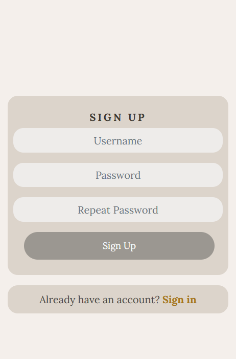
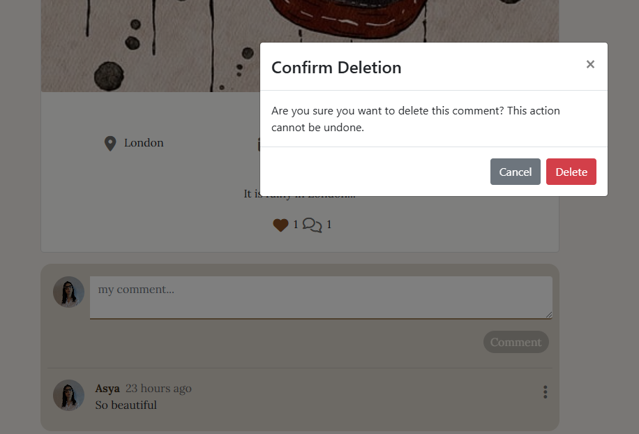
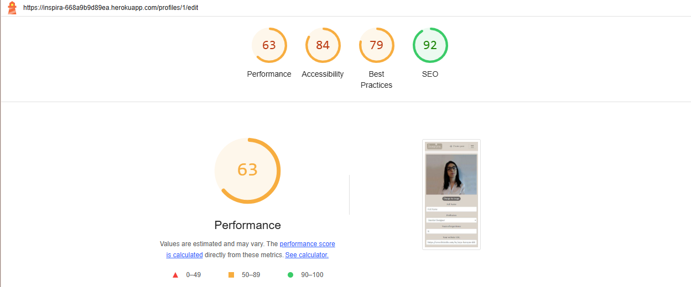
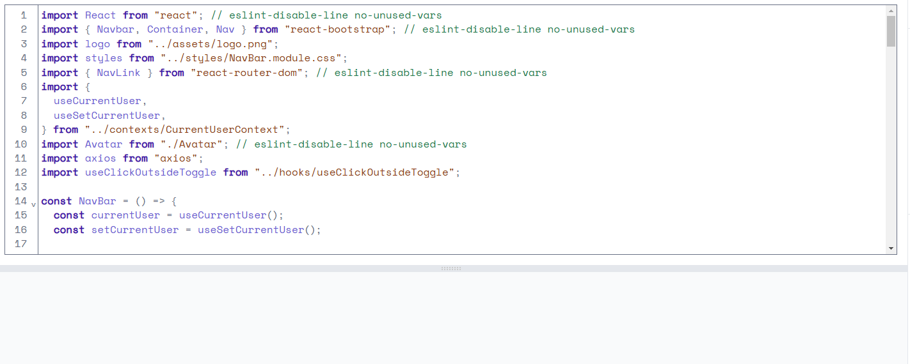
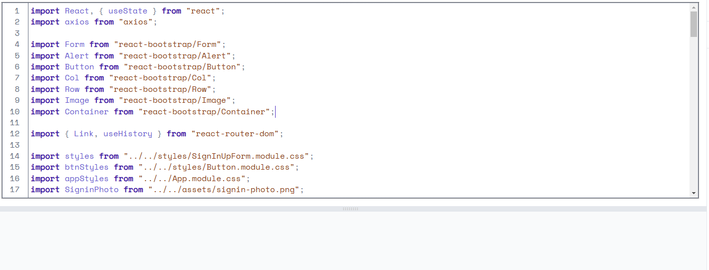
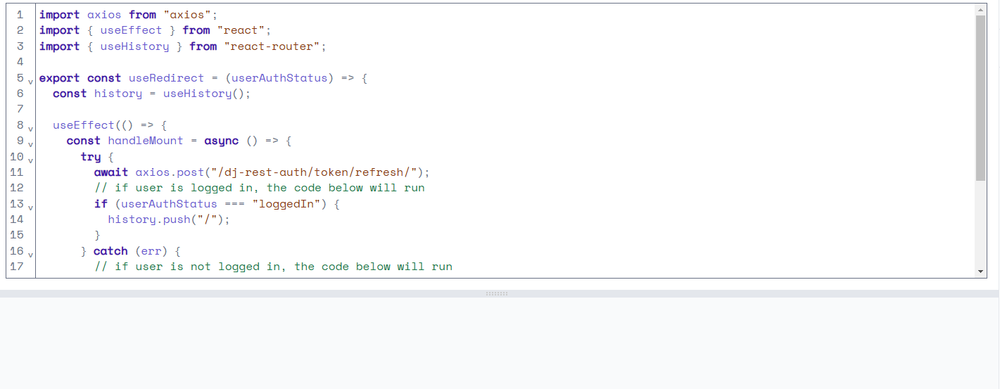

# Inspira - Advanced Front End (React)

Inspira is a dynamic online platform designed for designers, architects, and artists to discover fresh inspiration, showcase their latest projects, and engage with a global community of creative professionals for valuable feedback and collaboration.

Find Inspira live site here - [Inspira](https://inspira-668a9b9d89ea.herokuapp.com/)

Find live API here - [Inspira API](https://inspira-api-bc9117602418.herokuapp.com/)

Find API Repository here - [API repository](https://github.com/asyaharoyan/api-inspira)

# Contents
- [**User Experience UX**](#user-experience-ux)
  - [Project Goals](#project-goals)
  - [User Stories](#user-stories)
  - [Design Prototype](#design-prototype)
  - [Design Choices](#design-choices)
  - [Typography](#typography)
  - [Colour Scheme](#colour-scheme)
  - [Project Management](#project-management)
- [**Permissions**](#permissions)
  - [Logged Out User](#logged-out-user)
  - [Logged In User](#logged-in-user)
  - [Staff User](#staff-user)
- [**Existing Features**](#existing-features)
  - [Informative Splash Page](#informative-splash-page)
  - [Responsive Navigation Bar](#responsive-navigation-bar)
  - [Search Bar](#search-bar)
  - [Role Icons](#role-icons)
  - [Champion Card](#champion-card)
  - [Account Creation](#account-creation)
  - [Profile Page](#profile-page)
  - [Page Not Found](#page-not-found)
  - [Champion Create](#champion-create)
  - [Champion Edit](#champion-edit)
  - [Champion Delete](#champion-delete)
  - [Champion Information Page](#champion-information-page)
  - [Comments](#comments)
  - [Upvoting](#upvoting)
  - [Leaderboard](#leaderboard)
  - [Notifications](#notifications)
- [**Future Features**](#future-features)
  - [Items](#items)
  - [Events](#events)
  - [News](#news)
  - [Teams](#teams)
  - [Contact Form](#contact-form)
  - [Improved Profile Page](#improved-profile-page)
- [**Technologies Used**](#technologies-used)
- [**Testing**](#testing)
- [**Deployment To Heroku**](#deployment-to-heroku)
- [**Credits**](#credits)
  - [**Content**](#content)
  - [**Media**](#media)
- [**Assessor Information**](#assessor-information)
- [**Acknowledgments**](#acknowledgements)

# User Experience (UX)

## Project Goals

- Provide a space where designers, architects, and artists can share their work, get feedback, and collaborate on projects across disciplines.
- Ensure that users can seamlessly explore content and interact with posts, profiles, and projects in an intuitive and engaging manner.
- Help users discover new trends, ideas, and inspiration by showcasing a diverse range of projects and connecting them with like-minded professionals worldwide.
- Enable users to follow their favorite creators, like and comment on posts, and stay up-to-date with the latest work and ideas in the design and creative community.
- Allow users to create and manage profiles, track their work, and control the visibility of their posts and projects.

## User Stories

See all the user stories [here](https://github.com/users/asyaharoyan/projects/7/views/1).

## Design Prototype

The user interface and experience (UI/UX) design for Inspira was crafted using [Figma](https://www.figma.com/), ensuring a seamless and visually appealing design that enhances the user's journey throughout the site.

To view the Figma project, you can visit it [here](https://www.figma.com/design/jsSjnZu2QlOO2bFqOYtyzt/INSPIRA?node-id=0-1&t=0X02r4BdYG0j5pP6-1),

## Components

This project was created using React which allows for the re-use of components throughout the application. A react component is able to perform a multitude of operations such as render elements on a page, display data, handle events/user interactions, communicate to other components via props and much more.

## Design Choices

### Typography

  The font chosen for this project is Lora from google fonts. Different font sizes have been used throughout the website where appropriate. All fonts will fall back to sans-serif if Lora font can't be loaded.

### Color Scheme

  The colores are neutral and light, to let the user's projects stand out instead of taking all the attention from the users.

  

## Project Management

### GitHub Project Board

  To keep track of the progress and milestones of my project, I created user stories through GitHub issues. This approach allowed me to effectively monitor what had been completed and what tasks remained, ensuring a structured and organized development process.

  

## Permissions

The users have different permissions depending on if they are logged in or not.

### Logged Out User

A logged out user will have access to the following

- Home Page
- Info page
- View other users posts
- See popular profiles
- Sign In Page
- Sign Up Page

### Logged In User

A logged in user will have access to the following

- Home Page
- Sign Out Page
- Info page
- Create post
- Liked Page
- Comment
- Edit own profile
- Edit/delete own comments
- Change password
- View other users profiles' details and posts
- Follow/unfollow users
- Like posts
- See popular profiles

## Existing Features

### Responsive Navigation Bar

  The navigation bar is fully responsive, adjusting to different screen sizes to ensure a seamless user experience across devices.
  On larger screens, the navigation bar is displayed horizontally for easy access to key sections of the site. On smaller devices, the navigation bar is transformed into a "burger" menu, which can be expanded with a click. Once a link is selected, the menu closes automatically, allowing for a cleaner and more efficient navigation experience.

  The navigation bar also includes a clickable logo, which redirects the user back to the homepage for easy access.

  It renders different icons depending on if the user is logged in or not.

  For not logged in users it shows following menu

  - Home
  - Info
  - Sign In
  - Sign Up

  If the user is logged in, they will see the following drop-down menu

  - Home
  - Info
  - Create post
  - Liked
  - Sign out
  - Avatar

### Search bar

The search bar is a core feature of the platform, available to both logged-in and logged-out users. Its design prioritizes ease of use and a seamless user experience.

Users can search for a wide range of content, including:
- Names (e.g., profile or project names).
- Styles (e.g., modern, industrial).
- Areas (e.g., geographic locations or types of spaces).
- Area Names (e.g., specific rooms or landmarks).
- Keywords (e.g., matching text in project descriptions or tags).

As the user types, the search bar provides real-time suggestions and displays matching results instantly.
This eliminates the need for users to click "Enter" or a search icon, offering a faster and more intuitive experience.

### Posts card

The Post Card component is a reusable, dynamic feature designed to display posts consistently and engagingly across the platform. Posts are fetched via infinite scrolling, providing a seamless browsing experience without the need for pagination.

It includes the author, post date, location, completion date, style, area type, post name, content snippet, likes, and comments.

Users can like posts, comment, and engage directly from the card.

Adapts to different screen sizes and dynamically renders posts for smooth scrolling, even with extensive content.

Infinite scrolling ensures uninterrupted exploration of content.
Clean and intuitive layout highlights key details while encouraging interaction.

### Create post page

The Create Post page allows users to share their projects by uploading a picture, adding a title, and selecting key details like style, area type, location, completion date, and content.

Users cannot create a post without a title, style, or picture, ensuring quality and discoverability. This page fosters creativity and community engagement by making posts informative, searchable, and inspiring.

It is responsive for mobile phones and bigger screens.

### Post page

The Post Page displays all the details of a post, including comments and likes. If the user is the post owner, a menu icon with three dots allows access to additional actions.

- Edit Post: Redirects the user to a responsive edit form where they can update any aspect of the post's details. Changes can be saved or canceled.

- Delete Post: Opens a confirmation pop-up window to ensure intentional deletion.
This setup provides a streamlined and user-friendly experience, with responsive design ensuring accessibility across devices.

### Most Active Profiles

The Most Active Profiles section highlights users with the highest number of posts. On larger screens, it appears in the right corner, displaying the profile picture, user name, and a follow button for each profile.

On mobile devices, this section is integrated into the search bar, prioritizing space efficiency by hiding the follow buttons while still showing the profile picture and user name. This ensures a seamless and responsive user experience across all screen sizes.

### Sign in/ Sign up

The Sign In form allows users to log in by providing their username and password. If the credentials are incorrect, a clear error message notifies the user.

The Sign Up form requires users to input a username, password and confirm their password. 

Both forms feature an accompanying image, enhancing the visual appeal. On smaller screens, the image is hidden to maintain a clean and responsive design.

### Informative info page for terms and conditions

The Info Page provides users with essential details about the platform, including how it works and guidelines for using the website. It includes the Terms and Conditions, which outline the platform's rules and user expectations. While the terms are currently general due to time constraints, they will be refined to be more specific and professional in the future. This ensures that users fully understand the platform's usage policies before signing up.

### Liked page

The Liked Page collects all the posts that a user has liked, making it easy to revisit them later without needing to search or scroll through the platform again. This feature serves as a personal collection of posts for future reference. In the future, the page will be enhanced with a PIN function, allowing users to pin posts that are important for future interactions. This will help distinguish between posts that are mere likes and those that are crucial for ongoing inspiration or projects, ensuring a more organized and efficient user experience.

### Profile page

The Profile Page is accessible only to logged-in users and displays personal details such as the user’s location, years of experience, website, profession, bio, full name, and profile picture. This information is fully editable.

If the user owns the profile, a three-dot menu appears in the top-right corner, providing options to change the password, username, and profile details. Users can upload a custom profile picture, or the platform will use a default one if none is provided. While the profession is a required field, other details such as bio and location are optional, allowing users to personalize their profile as they wish.

Password Edit

Username Edit

Profile edit

Profile edit phone

### Comment / Like

Logged-in users can interact with posts by liking or commenting. When a post is liked, the heart icon appears filled, indicating a like, while an unliked post shows an empty heart shape. Users can toggle their like by clicking the heart again to dislike the post.

Clicking on a post redirects the user to its dedicated page, where they can view all comments and add their own. If the user is the owner of a comment, three dots will appear, allowing them to edit or delete the comment.

When the user chooses to delete, a confirmation popup will appear to verify the action. If the user opts to edit, they can modify the comment and either save the changes or cancel the edit.

### Feedback and Validation Across Forms

The platform is designed with a user-centric approach, ensuring clear feedback and validation across all forms to enhance the user experience and maintain a high standard of professionalism.

**Sign-Up Form**
- Includes fields for username, password, and repeat password.
- Feedback ensures passwords are at least 8 characters, not too common, and match.

**Sign-In Form**
- Includes fields for username and password.
- Feedback ensures that there is a user with provided credentials, otherwise gives a clear feedback

**Profile Edit Form**
- Profession defaults to "Architect" when creating a new profile and if in edit form no profession has been chosen, it changes back to the last choice.
This feature will be improved to require user input in sign up form in the future.

The years of experiense can not be a negative number.

**Create and Edit Post Form**
- Requires a title, style, and picture. Users receive immediate feedback for missing fields or empty posts.

Create post form

Post Edit form

**Other feedbacks**

### Not found
The page has been designed to show a clear information to the user. It is custom designed for Inspira app.

## Future Features

### Restricting Future Completion Dates
In the future the app will not allow the users to choose future completion date. This will make the users to share more accurate data in the app. It is important for other users to know when the project was completed to be able to follow the latest trends in design and art.

### Validating Locations Input
The app will have a feature to validate the location to avoid false data in app. It will also have a possibility for other users to ckick on location and see where the person is from in case the name of the city is not recognized. 

It will help professionals to find likeminded collegues as well as be able to see the completed projects when they travel.

### Upload Multiple Pictures for a Single Post
As a designer or architect they usually want to share more then one picture of the project as the projects are usually big and can not been shown with one post. The feautre will be added in the future

### Keep Picture During Post Edit
In the project there is a problem with editing the post as the post is not possible to change and keep the same picture unless we don't reupload it. This can be a bad user experience. The bug will be fixed in the future.

### Pinning Posts for Inspiration
Usually designers and architects want to be able to like and pin posts for future inspirations. In the future this function will be devided in two buttons and funtions. Like will only handle one action, to like a project while pin will save the post for the future as not every post which we like we use for the future inspiration. It will also have a possibility to create folders to keep different projects't inspirations to make user experience better.

### Future Improvements for Signup Form
The upcoming improvements to the signup form will enhance user registration by ensuring that the platform attracts only relevant professionals. Here's a breakdown of the changes:

**Required Fields:**
Profession: This will be a required field, ensuring that users identify themselves as professionals in a specific field. By making this a compulsory field, it sets a clear tone that the platform is for industry professionals and not for random sign-ups.

Name and Surname: The user will be required to enter both their first and last name. This adds credibility and creates a more professional environment from the start.

**Optional Fields:**
Website: Users will have the option to provide a personal or business website, which will help build their profile and provide more context about their work.
Location: While not mandatory, users can choose to add their location. This could foster a more personalized experience, helping users connect with others in their region or field.

Experience: An optional field that lets users add details about their professional experience. This can serve to further highlight their expertise and qualifications.

By implementing these fields, the signup process will help identify qualified professionals while also allowing users the flexibility to showcase additional details. These changes will create a more curated and professional environment, increasing the platform's appeal to its target audience.

# Technologies Used

## Languages

- [JavaScript](https://www.javascript.com/) - A dynamic programming language that's used for web development
- [HTML](https://en.wikipedia.org/wiki/HTML5) - A markup language used for structuring and presenting content
- [CSS](https://en.wikipedia.org/wiki/CSS) - A style sheet language used for describing the presentation of a document

## Libraries and Frameworks

- [React](https://reactjs.org/) - Advanced front-end JavaScript library for building user interfaces
- [React Bootstrap](https://react-bootstrap.netlify.app/) - Popular CSS Framework for developing responsive and mobile-first websites
- [Font Awesome](https://fontawesome.com/) - A font and icon toolkit based on CSS
- [Google Fonts](https://fonts.google.com/) - A library of open source font families and APIs for convenient use via CSS

## Other Tools

- [Favicon](https://favicon.io/) - Used to create the favicon.
- [GitPod](https://www.gitpod.io/) - Used to create and edit the website.
- [GitHub](https://github.com/) - Used to host and deploy the website as well as manage the project.
- [Google Chrome DevTools](https://developer.chrome.com/docs/devtools/) - Used to test responsiveness and debug.
- [Figma](https://www.figma.com/) - Used to create mock-up designs.
- [Corel Draw](https://www.coreldraw.com/en/) - Used to create images and remove backgrounds where needed.
- [Heroku](https://dashboard.heroku.com) - Used to deploy the website

# Testing

## Code Validation

## Lighthouse Testing

The app has been tested on LightHouse. The results will be improved in the future as there is a space to improve the performance of the app.

For mobiles

- Home page

- Create post

- Info page

- Liked page

- Post Edit page

- Profile page

- Profile edit page

- Sign in page

- Sign up page

For desktops

- Home page

- Create post

- Info page

- Liked page

- Post Edit page

- Profile page

- Profile edit page

- Sign in page

- Sign up page

## Responsiveness Testing

The app has been tested on:

- Larger screens 1200px and more

- Tablets

iPad mini

iPad Air

iPad Pro

Surface Duo

Surface Pro

- Phones

iPhone 12 Pro

iPhone 14 Pro

iPhone XR

Pixel 7

Samsung Galaxi S8+

Samsung Galaxi S20 Ultra

## Code Validation

The code has been validated in [ESLint](https://eslint.org/play/).

Avatar.js

axiosDefaults.js

Comment.js

CommentCreateForm.js

CommentEditForm.js

CurrentUserContext.js

InfoPage.js

MoreDropdown.js

NavBar.js

App.js

NotFound.js

PopularProfiles.js

Post.js

PostCreateForm.js

PostEditForm.js

PostPage.js

PostsPage.js

Profile.js

ProfileDataContext.js

ProfileEditForm.js

ProfilePage.js

SigninForm.js

SignupForm.js

useClickOutsideToggle.js

useRedirect.js

UsernameForm.js

UserPasswordForm.js

## Manual Testing Pages

### Navigation Bar
- The logo is displayed on the left side of the navigation bar.
- The Create Post button appears next to the logo when the user is logged in.
- On the right side of the screen, Home, Info, Liked, Sign Out, and the user avatar are rendered next to each other.
- For smaller screens, the menu is collapsed into a burger icon for better accessibility.
- The Create Post button disappears when the user is logged out.
- Liked and Sign Out options, as well as the user avatar, are hidden for logged-out users.
- Sign In and Sign Up options are displayed in the navigation bar when the user is logged out.

### Home Page
- The navigation bar is displayed at the top of the page.
- A search bar is available for easy access.
- The most active profiles are shown on the right side of larger screens and below the navigation bar on smaller screens.
- Follow/Unfollow buttons are displayed next to the name of the most active profiles for logged-in users on larger screens.
- The profile pictures and names of the most active profiles are rendered as expected.
- Profiles with the most posts are rendered in descending order, with the profile having the most posts displayed first.
- Infinite scrolling works as expected, loading content seamlessly.
- The posts are displayed in reverse order, with the most recent posts shown first.

### Info Page
- The Info page displays all relevant content.

### Liked Page
- The page shows all posts that the user has liked.
- Posts are rendered as expected in a card format.
- The posts are displayed in reverse order, with the most recent liked posts shown first.

### Create Post
- The post creation form is displayed correctly.
- The photo upload area is rendered as expected.
- A drop-down menu for selecting style and area type is available.

### Profile Page
- The profile picture is displayed correctly.
- The bio appears to the right of the profile picture.
- Additional information such as followers, following, profession, experience, website, and location is shown beneath the profile picture, aligned horizontally.
- Empty fields in the user's profile are displayed as expected, with "--".
- The user's posts are displayed properly.
- A three-dot menu appears if the user is the profile owner.
- Follow/Unfollow button is rendered as expected.
- Profile information is not rendered for logged out users. Instead a link is available to sign in

### Profile Edit Page
- The profile edit form is displayed on the right for desktops and below the picture for smaller screens.
- A drop-down menu for selecting professions is available.
- The profile picture is displayed on the left for desktops and at the top for smaller screens.
- A button to change the profile picture is present.
- Confirm and cancel buttons are visible and functional.
- Edit password and username forms are displayed as expected.

### Sign In Page
- The sign-in form for username and password is displayed correctly.
- The sign-in button is rendering as expected.
- A message with a link to the sign-up page is displayed under the form.
- A picture appears next to the sign-in form on larger screens, disappearing on smaller screens for a cleaner design.

### Sign Up Page
- The sign-up form for username, password and confirming password form is displayed correctly.
- The sign-up button is rendering as expected.
- A message with a link to the sign-in page is displayed under the form.
- A picture appears next to the sign-up form on larger screens, disappearing on smaller screens for a cleaner design.

## Manual Testing Features

### Navigation
- Clicking the logo redirects the user to the `/home` page.
- The Home, Info, Sign In, Sign Up, and Liked links redirect the user to their respective pages: `/home`, `/info`, `/liked`, `/signin`, and `/signup`.
- Clicking on the avatar redirects the user to their profile page.
- Clicking on Create Post redirects the user to `/posts/create` page
- Logged-out users cannot see the Liked, Sign In, or Sign Up options in the navigation bar.
- Logged-out users do not see the Avatar in the right corner of the navigation bar.
- On smaller screens, the navigation bar is converted into a burger menu, which opens when the user taps on it.
- The burger menu automatically closes when the user selects an option or taps outside of the menu.
- Sign Out button sign out the user from the page.

### Home Page
- The Search Posts bar is functioning as expected, fetching data based on the user's name, matching words, style, and more.
- Clicking on the post card image redirects the user to the `/posts/id` page for the selected post.
- Clicking on the avatar of the user who made the post redirects the user to the `/profiles/id` page.
- When hovering over the heart or comment icon, their shape and color change to indicate interactivity.
- Clicking the heart icon likes the post, adds it to the Liked page, changes the icon's color, and increases the like count.
- Clicking the comment icon redirects the user to the `/posts/id` page, where they can leave a comment if logged in.
- If a user is not logged in and tries to like a post, a clear message appears: "Log in to like posts."
- If a user is not logged in and clicks on the comment button, an information message appears with a link to redirect the user to the sign-in page.
- Mos Active Profiles appears for everyone and clicking on their avatar redirects the user to their profile page
- Logged in users can follow or unfollow the most active profiles with a button appearing next to the profile for bigger screens.
- The button updates depending on if the logged in user is following or not following the user.

### Sign In page
- The form provides clear feedback to users who attempt to sign in with non-existing or incorrect credentials.
- The Sign Up link works as expected, redirecting the user to the `/signup` page.
- Sign Up button redirects the user to the Home page.

### Sign Up page
- The form provides clear feedback to users who attempt to sign up with short, non matching or empty passwords. It provides feedback if the password is too common, shorter then
8 characters.
- If the passwords do not match the form provides clear feedback.
- The Sign In link works as expected, redirecting the user to the `/signin` page.
- Sign Up button redirects the user to Sign In page.

### Liked page
- Unlked post is removed from Liked Page after refreshing as expected.
- The user can click on the post and redirect to the post page.

### Create Post page
- When clicked on the upload picture on the left side of the screen, a window is opened to choose a picture.
- If the picture is larger then 2MB, a clear feedback is appeared.
- The user can not leave the title, the style and the image fieled empty as expected.
- The drop-down menu fetches the data from the backed for styles and area types.
- The user can choose a date from the calendar
- Cancel button redirects the user to the previous page.
- Create button redirects the user to the post page.

### Profile Page
- The 3 dots open a menu to navigate to Edit Profile, Username, and Password pages.  
- Clicking on any of these options redirects the user to the respective page.  
- The website link in the profile is clickable and opens in a new window as expected.  
- Clicking on post cards redirects the user to the `/posts` page, displaying more details about the selected post.

### Profile Edit Page  
- In the Edit Username form, the user can change the username and confirm it.  
- In the Edit Password form, the user needs to write and confirm the new password.  
- The Cancel and Save buttons always redirect the user to the profile page.  
- Clicking on the Cancel button ensures no changes are made.  
- Clicking on the Save button applies all the changes.  
- In the Edit Profile form:  
  - The current profile picture is displayed with a button to upload a new one.  
  - Clicking the button opens a window to select a new picture.  
  - If the picture exceeds 2MB, a message appears.  
- The Years of Experience field does not accept negative values.  
- The Website field does not allow invalid URLs.

### Post Page
- It renders real time date on the right corner of the post
- If the user owns the post, 3 dots appear as expected.  
- Clicking on the dots opens a menu with options to Edit or Delete the post.  
- Clicking on the Delete button displays a confirmation form.  
  - Confirming the deletion removes the post and redirects the user to the Home page.  
  - Clicking on the Cancel button keeps the user on the same page.  
- Clicking on the Edit button redirects the user to the `/posts/id/edit` page.  
- Logged-in users can access a form to leave a comment.  
- Logged-in users can also like or unlike the post.

### Post Edit Page  
- The Post Edit page allows the user to update the Title, Style, Area Type, Location, Completion Date, and Content, as well as remove or add information.  
- The user cannot save the post if the Style or Title fields are empty.  
- The Style and Area Type fields open drop-down menus, with data fetched from the backend to display available options.

### Like  
- The heart icon changes color when hovered over.  
- A message is displayed for logged-in users attempting to like their own posts, informing them that this action is not allowed.  
- A message appears for users who are not signed in, prompting them to sign in to like posts.  
- The heart icon becomes full when a user likes a post and returns to an empty state when the user unlikes the post.  
- The number next to the heart icon updates accordingly to reflect the current number of likes.

### Comment  
- Clicking on the comment icon redirects the user to the `/posts/id` page.  
- Logged-in users can leave a comment.
- Comment owners see 3 dots next to their comments, providing options to Edit or Delete the comment.
  - Clicking on the Delete button shows a pop-up menu to confirm the deletion.
  - Clicking on Edit allows the user to modify the comment and confirm the changes.
  - Clicking on Cancel redirects the user back without making changes.
- Non-logged-in users cannot leave comments and instead see a link to Sign In.
  - The link redirects the user to the `/signin` page.

## Browser Compatibility

  - All the above manual tests have been completed in the following desktop browsers
    - Google Chrome
    - Microsoft Edge
    - Firefox

## Bugs Fixed

Used class instead of className - Searched all classes and changed them to className

Choosing date does not work in create post form - The problem was that i was updating formData, needed to update postData.

Can not change the profile page - fixed

It logs in after refreshing the page - it has been fixed. The link in log out form was wrong in backend.

Chosen profile does not show in profile image - It has been fixed by changing src attribute in profile image.

It does not show that the picture has been changed but it changes in profile edit form - It had been fixed by changing variable. Instead of image should have been avatar.

The profile picture did not appear in NavBar, next to the comments or posts - Fixed

It has been fixed by debugging with console.logs. As it appears I had a wrong path in my backend.

Changing the name of the source to avatar gave the same error and that it is undefined

Profile image was undefined too and it made clear that it is not being connected to the front end because of the source.

In preview it showed that profile_image is not with the user 4

The problem was from the backend. In serializers.py profile_image was defined wrong.

    profile_image = serializers.ReadOnlyField(source='profile.image.url')

It has been changed to
    profile_image = serializers.ReadOnlyField(source='profile.avatar.url')

The profile picture is not updating on the right corner if I don't refresh the page - fixed by editind ProfileDataContext.js file.

When I click on follow button it does not update at once - fixed by editing PopularProfiles.js file.

## Bugs Unresolved

Can not let the picture to be the same in post edit form. It forces the user to choose a picture as it removes the old one.

If the user is not logged in and there is a comment, the link is not present to redirect the user to the sig in page.
The issue is there because of the logic. It will be resolved in the future.

The popular profiles are not being scrolled with the content. The issue is not a priority and will be resolved in the future development.

If the user is logged out a error message appears in the console. The error will be handled by having a message instead of the error.

Other error messages appearing. The errors were not possible in this stage of development.

# Deployment To Heroku

The project was deployed to [Heroku](https://www.heroku.com). The deployment process is as follows:

Create a new repository in [GitHub](https://github.com/) where the project files will be located

Once created the repository was pulled to GitPod

Create a React APP by typing on the terminal  **npx create-react-app . --use-npm**

Test that the application is working by typing **npm start** in the terminal

After making sure it is working, git add, commit and push the project to GitHub.

For deploying the project in Heroku

- Navigate to Heroku
- Click **New app**
- Fill in the relevant information
- Click **Create app**

Link our Heroku application with GitHub project

- Click the **Deploy** tab
- Choose **GitHub**
- Search for the repository
- Once found, click **Connect**

Finally click **Deploy Branch** and wait for it to build

# Credits

### Content

This project was inspired by the [Code Institute](https://codeinstitute.net/) walk-through **Moments** project and has been modified to serve the purpose of the **Inspira** project.

Many of the files had been copied from the **Moments** walkthrough and modified accordingly as the time is short and not possible to recreate everything from the scratch.

### Media

All the pictures which has been shared are my own projects.

The logo of the application has been designed by me using **CorelDraw**

Default profile pictures had been downloaded from **Google** and has been used only for educational purposes.

### Acknowledgments

The project was extremely challenging and I would not be able to finish it without the support I recieved from my mentor **Julia Konovalova**,
the tutors who helped me to debug my project when needed, **Code Institute** walkthrough and the Slack community.

